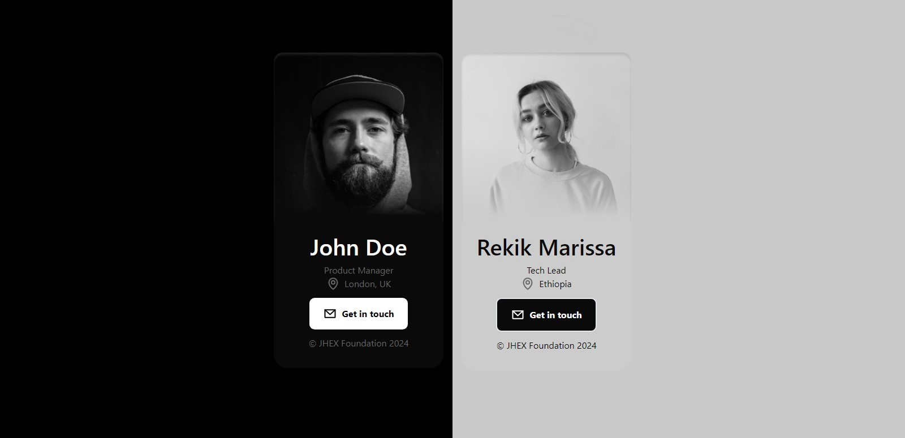

<h1 align="center">
Dynamic Profile
</h1>


<div align="center">

<h2>

[🚀Live Site](<!-- link to the site -->) || devjhex

</h2>
</div>

<!-- Badges -->
<div align="center">
    

<!-- License -->


</div>

<p align="center">
This is a web application that showcases the functionality of a dynamic profile. Users are able to see the status of employees of a certain company. The project follows the <code>Model-View-Controller (MVC)</code> architectural pattern to separate data, presentation, and user interaction.
</p>

<!-- Screenshots -->
<a align="center">



</a>

## Technologies Used

- Vanilla JavaScript for application logic and event handling.
- Tailwind for styling of the markup.
- HTML for markup.

## Project Structure

The project follows the MVC pattern to organize the code into three main components:

1. **Model (class Model):**

   - Handles fetching data from a file.
   - Manages the current user data and current date and time.

```javascript

    async fetchData(){
            //... fetches data from a file or server.
    }

```

2. **View (class View):**

   - Responsible for the presentation and rendering of data to the DOM.
   - Utilizes the generated HTML markup templates to display comments and other elements.
   - Implements methods to render employees markup on the page.

```javascript
class View {
    //...Other functions

   renderEmployee(data){
     //...Handles the rendering of the employees on the page.
    }
}
```

3. **Controller (class Controller):**
   - Acts as the middleman between the Model and View components.
   - Connects user actions to corresponding Model methods for data manipulation.

```javascript
    async init(){
        //... Handles the initialization of the project
    }
```

## Key Features

Users should be able to:
- View all the employees available together with their updated data.
- **Bonus**: Dark mode toggler.

## Author

<b>👱🏿‍♂️ devjhex</b>

- Twitter - [@devJhex](https://www.twitter.com/devJhex)
- Frontend Mentor - [@devjhex](https://www.frontendmentor.io/profile/devjhex)
- Github: [@devjhex](https://github.com/devjhex)

Feel free to contact me with any questions or feedback!

<!-- 
## License

This project is licensed under the [MIT](https://github.com/CodePapa360/Interactive-comments-section/blob/main/LICENSE.md) License - see the LICENSE file for details.
 -->